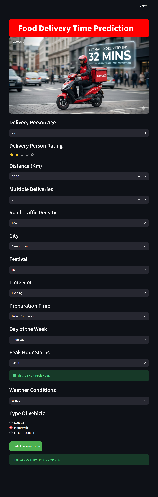
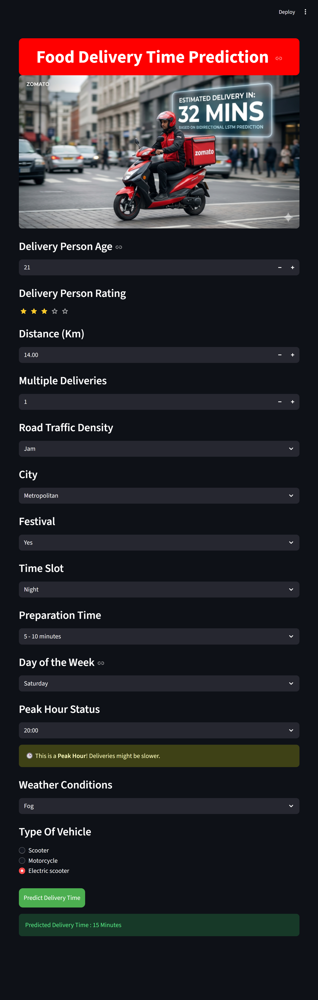
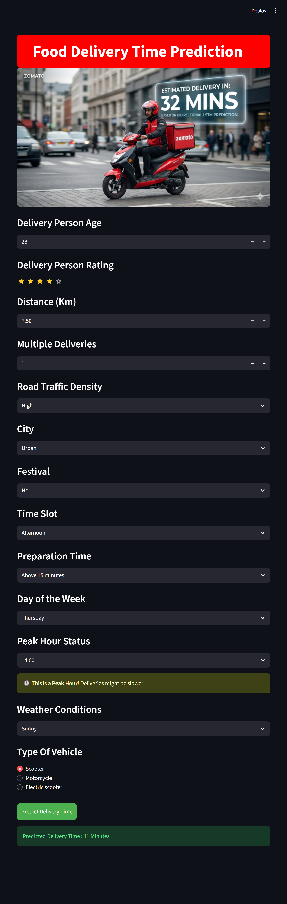

# Zomato Food Delivery Time Prediction

## Project Overview

This project predicts food delivery time using Machine Learning.

## Technologies Used

- Python
- Pandas
- Scikit-learn
- XGBoost
- Streamlit

## Deployment

The application was deployed using Streamlit.

## Application Screenshot





## Run Locally

```bash
pip install -r requirements.txt
streamlit run app.py
```
